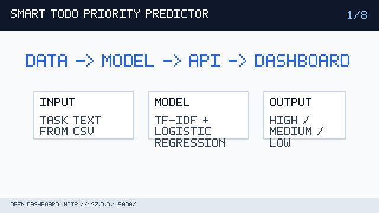
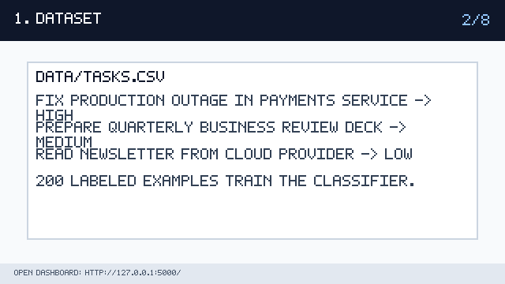
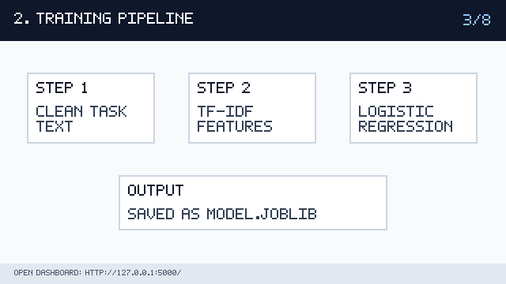
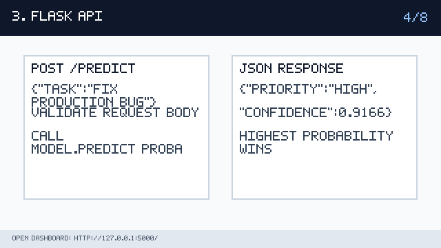
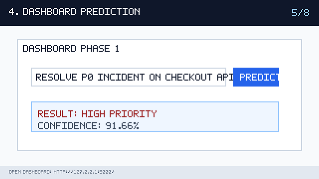
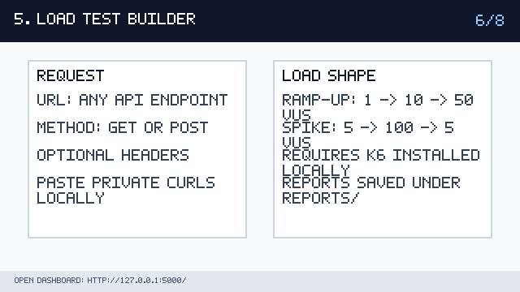
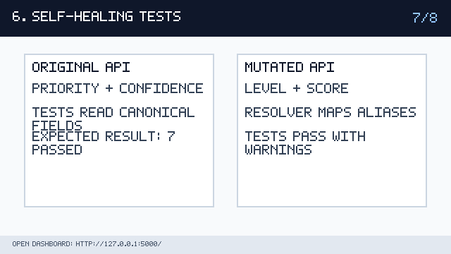
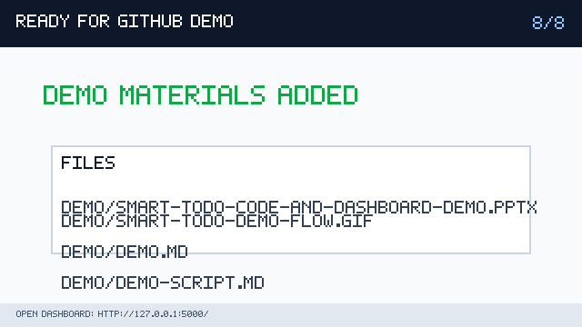

# Smart Todo Demo Walkthrough

This file is designed to render directly in GitHub. The animated walkthrough below replaces the old AVI file because GIF previews work inside GitHub markdown.

## Recorded Dashboard Demo

Watch the recorded dashboard flow here:

[smart-todo-dashboard-demo.mp4](smart-todo-dashboard-demo.mp4)

## Phase 2 Request Safety

Do not commit private curl commands, bearer tokens, or internal service URLs. For the live demo, paste any private request directly into the dashboard curl parser on your machine.

## Screenshots And Explanation

### Overview

The whole project flow: CSV data becomes a model, Flask serves it, and the dashboard demonstrates it.

### Dataset

The task labels in data/tasks.csv teach the classifier the difference between High, Medium, and Low priority work.

### Training

train.py cleans text, builds TF-IDF features, trains Logistic Regression, and writes model.joblib.

### API

app.py exposes /health and /predict. The prediction route validates JSON, calls the model, and returns priority plus confidence.

### Dashboard prediction

Phase 1 lets the presenter type a task and see the live model response in the browser.

### Phase 2 load test

The load-test builder targets the local API by default. Private curls can be pasted locally during the live demo without committing them.

### Phase 3 tests

Self-healing tests pass on the original API and on a mutated API that returns level/score instead of priority/confidence.

### GitHub assets

The repo includes a PPT, a GitHub-viewable GIF, this DEMO.md walkthrough, and screenshot panels.
